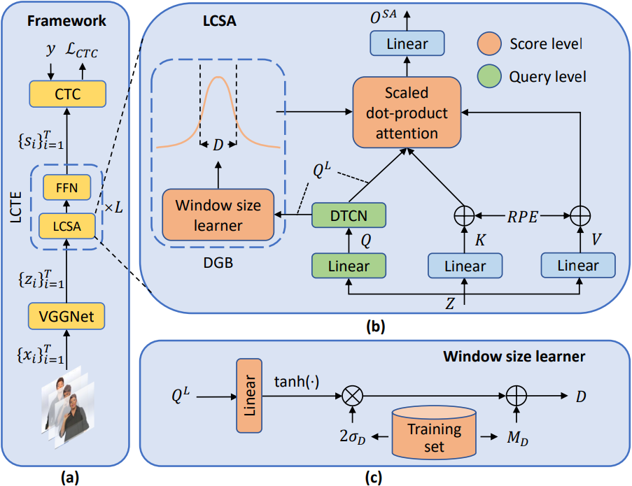
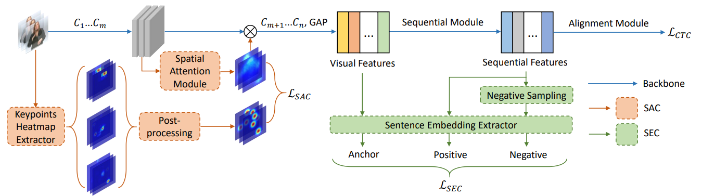
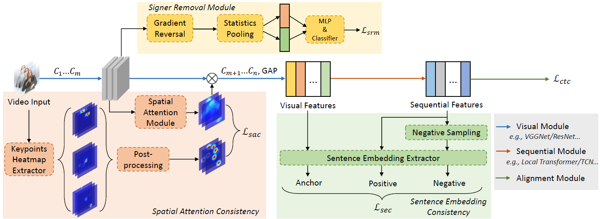

# LCSA_C2SLR_SRM

This repo contains the official implementations of the following papers on (signer-independent) continuous sign language recognition (CSLR).

- [Interspeech 2022] Local Context-aware Self-attention for Continuous Sign Language Recognition. [[Paper]](https://www.isca-speech.org/archive/pdfs/interspeech_2022/zuo22_interspeech.pdf) 

- [CVPR 2022] C2SLR: Consistency-enhanced Continuous Sign Language Recognition. [[Paper]](https://openaccess.thecvf.com/content/CVPR2022/papers/Zuo_C2SLR_Consistency-Enhanced_Continuous_Sign_Language_Recognition_CVPR_2022_paper.pdf)

- [TOMM 2024] Improving Continuous Sign Language Recognition with Consistency Constraints and Signer Removal. [[Paper]](https://arxiv.org/pdf/2212.13023.pdf)


## Local Context-Aware Self-Attention (LCSA)
### Introduction
An improved Transformer for temporal modeling in CSLR models. We propose to enhance self-attention at two levels: query computation and attention score modulation. For the latter, we propose a novel dynamic Gaussian bias, whose window size can be adjusted automatically.



### Performance
| Dataset | WER (Dev/Test) | Ckpt&Cfg | 
| :--- | :---: | :---: | 
| Phoenix-2014 | 21.4/21.9 | [link](https://hkustconnect-my.sharepoint.com/:f:/g/personal/rzuo_connect_ust_hk/EgmoUv0SC9tDjhBirUlJibQBoGhtK6XgCkt4CwvZIRlWEg?e=sLQHos) |
| CSL | --/1.4 | [link](https://hkustconnect-my.sharepoint.com/:f:/g/personal/rzuo_connect_ust_hk/EgrqtodYfktAq272nop61lsB5-TJiyBvttKviZIRnSM5Fw?e=xARs4Q) |


## Consistency-Enhanced CSLR (C2SLR)
### Introduction
Two consistency constraints to boost CSLR model performance. We first leverage pre-extracted keypoints heatmaps to guide an inner attention module in the visual module. Then we align visual and temporal features at the sentence level as a regularization. Both two constraints can improve CSLR model performance with negligible costs.



### Performance
| Dataset | WER (Dev/Test) | Ckpt&Cfg | 
| :--- | :---: | :---: | 
| Phoenix-2014 | 20.5/20.4 | [link](https://hkustconnect-my.sharepoint.com/:f:/g/personal/rzuo_connect_ust_hk/Epf69HvQCa5PilLpMYJi0EwBVaAXqR08xVfhLRQDd5J8Hg?e=tO2Hzr) |
| Phoenix-2014T | 20.2/20.4 | [link](https://hkustconnect-my.sharepoint.com/:f:/g/personal/rzuo_connect_ust_hk/EgcTPXObS5pGu8oFNCs2oEcB_aHqoN6lhLgg500AQ8QJpg?e=HQDveu) |
| Phoenix-2014-SI | 34.3/34.4 | [link](https://hkustconnect-my.sharepoint.com/:f:/g/personal/rzuo_connect_ust_hk/EtYK6Hy87XVOnaEmsr93vAgBBpgjkrhVEd-Up7SlqO9AZg?e=bzo3ML) |
| CSL | --/0.9 | [link](https://hkustconnect-my.sharepoint.com/:f:/g/personal/rzuo_connect_ust_hk/Eiup_UHLKkBBgmUj16oEoJQBcZfv9L3ggyl2V_Lo49PQUg?e=Y6fQ4P) |
| CSL-Daily | 31.9/31.0 | [link](https://hkustconnect-my.sharepoint.com/:f:/g/personal/rzuo_connect_ust_hk/En46gbpyvp1LvywVUFttZk8BObZzIdaAKr8scy2anO23hw?e=va7Jjz) |


## Signer Removal Module for Signer-Indepedent CSLR (SRM)
### Introduction
Existing CSLR works mostly focus on the signer-dependent setting, in which testing signers are all seen during training. However, in the real world, it is infeasible to build a dataset encompassing all signers. In this paper, we propose a signer removal module based on the idea of feature disentanglement. The module is pluggable and can make CSLR models more robust to signer variations.



### Performance on Signer-Independent Datasets
| Dataset | WER (Dev/Test) | Ckpt&Cfg | 
| :--- | :---: | :---: | 
| Phoenix-2014-SI | 33.1/32.7 | [link](https://hkustconnect-my.sharepoint.com/:f:/g/personal/rzuo_connect_ust_hk/Eph_N4l0Oo1JpYsG436eidIBW4aqR30ki-5c5YmN1pJ2Zw?e=NSqsmM) |
| CSL | --/0.68 | [link](https://hkustconnect-my.sharepoint.com/:f:/g/personal/rzuo_connect_ust_hk/Eol329uN3OdFj2z90sN6xYoBneprSqEB9tqdgCEyjlAH2g?e=U65jvT) |


## Usage
### Prerequisites
Create an environment and install dependencies.
```
pip install -r requirements.txt
```

### Datasets
Download datasets from their websites and place them under the corresponding directories in data/
* [Phoenix-2014](https://www-i6.informatik.rwth-aachen.de/~koller/RWTH-PHOENIX/) Note that Phoenix-2014-SI is just a subset of Phoenix-2014.
* [Phoenix-2014T](https://www-i6.informatik.rwth-aachen.de/~koller/RWTH-PHOENIX-2014-T/)
* [CSL](https://ustc-slr.github.io/datasets/2015_csl/)
* [CSL-Daily](http://home.ustc.edu.cn/~zhouh156/dataset/csl-daily/)

Then unzip all these data and put them into ../../data/

### Heatmaps
Heatmaps serve as the labels for spatial attention consistency. They are used in the papers of C2SLR and SRM.
The general process is (1) first run **gen_heatmaps.py** to get **finer_coords**, and (2) in each training iteration, the dataloader will automatically generate Gaussian heatmaps centered at those finer coordinates.


### Pretrained Models
There are two pretrained models: (1) VGG11 pretrained on ImageNet and (2) HRNet pretrained on MPII. Here is the [link](https://hkustconnect-my.sharepoint.com/:f:/g/personal/rzuo_connect_ust_hk/EljpR-arKvJEnf5OZ4Afy9QB8nfZsLPclg_vLcA644sing?e=ZebZHA).


### Training and Testing
The model checkpoints and configs are put in the same folder.
```
python main.py --config=config --mode=train
```
```
python main.py --config=config --mode=test
```


## Citation
Please cite our works if you find this repo is helpful.
```
@article{zuo2022local,
  title={Local Context-aware Self-attention for Continuous Sign Language Recognition},
  author={Zuo, Ronglai and Mak, Brian},
  journal={Proc. Interspeech},
  pages={4810--4814},
  year={2022}
}
@inproceedings{zuo2022c2slr,
  title={C2slr: Consistency-enhanced continuous sign language recognition},
  author={Zuo, Ronglai and Mak, Brian},
  booktitle={CVPR},
  pages={5131--5140},
  year={2022}
}
@article{zuo2022improving,
  title={Improving Continuous Sign Language Recognition with Consistency Constraints and Signer Removal},
  author={Zuo, Ronglai and Mak, Brian},
  journal={arXiv preprint arXiv:2212.13023},
  year={2022}
}
```